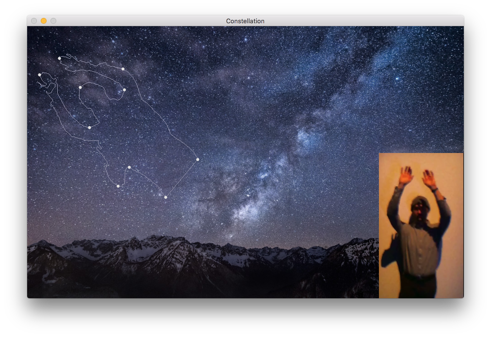

# autostellargraphy

[http://www.rpcarn.com/autostellargraphy](http://www.rpcarn.com/autostellargraphy)

The code as-is should run and demo show a short video as long as the Python libraries are installed correctly.

I installed these during development though Im not using all of them:

* Python 2.7.11
* OpenCV 3.1.0
* cycler 0.10.0
* django 1.9.4
* flask 0.10.1
* image 1.4.4
* itsdangerous 0.24
* jinja2 2.8
* markupsafe 0.23
* matplotlib 1.5.1
* numpy 1.10.4
* pillow 3.1.1
* pip 8.1.1
* pyparsing 2.1.0
* python-dateutil 2.5.0
* pytz 2016.1
* scikit-learn 0.17.1
* scipy 0.17.0
* setuptools 20.2.2
* six 1.10.0
* sklearn 0.0
* werkzeug 0.11.4
* wheel 0.29.0

I had to make these fixes and recompile OpenCV so getting OpenCV installed correctly will be the biggest challenge of using this code. Use Python virtual environments and follow the directions in the first link under References below.

1. [https://github.com/Itseez/opencv/issues/5874](https://github.com/Itseez/opencv/issues/5874)
2. [https://github.com/Itseez/opencv/pull/6009/files](https://github.com/Itseez/opencv/pull/6009/files)

If anybody looks at this project code then forgive me, this was my first Python app and I developed it quickly. :/

The socket-server.py and socket-client.pde (Processing 3) code are meant to be used to send data from Python to Processing. The code runs but the result doesnt look very good. First run the python server file. Then run the Processing client file. Both programs wil return a window playing a video. The Processing window shows a black background with a white animated contour roughly the shape as the one animated in the Python window.

## System setup

    # Create a Python virtual environment after installing OpenCV
    # (see first 
    # reference link below) and be sure to always change
    # to the python virtual environment before working.

    workon cv

    # when a python script requires a framework build of python
    # to run (such as matplotlib gui while running in virtualenv)
    # use this command to run the script using the system build
    # not just the virtual environment build.

    frameworkpython show-stars.py 

## References

#### OpenCV & Python

1. [http://www.pyimagesearch.com/2015/06/15/install-opencv-3-0-and-python-2-7-on-osx/](http://www.pyimagesearch.com/2015/06/15/install-opencv-3-0-and-python-2-7-on-osx/)
2. [http://docs.opencv.org/3.1.0/d4/d73/tutorial_py_contours_begin.html#gsc.tab=0](http://docs.opencv.org/3.1.0/d4/d73/tutorial_py_contours_begin.html#gsc.tab=0)
3. [http://docs.opencv.org/3.0-beta/doc/py_tutorials/py_imgproc/py_contours/py_contours_more_functions/py_contours_more_functions.html](http://docs.opencv.org/3.0-beta/doc/py_tutorials/py_imgproc/py_contours/py_contours_more_functions/py_contours_more_functions.html)
4. [http://docs.opencv.org/3.1.0/dd/d49/tutorial_py_contour_features.html#gsc.tab=0](http://docs.opencv.org/3.1.0/dd/d49/tutorial_py_contour_features.html#gsc.tab=0)

#### Video & Transformations
1. [http://opencv-python-tutroals.readthedocs.org/en/latest/py_tutorials/py_gui/py_video_display/py_video_display.html](http://opencv-python-tutroals.readthedocs.org/en/latest/py_tutorials/py_gui/py_video_display/py_video_display.html)
2. [http://www.pyimagesearch.com/2014/01/20/basic-image-manipulations-in-python-and-opencv-resizing-scaling-rotating-and-cropping/#comment-392456](http://www.pyimagesearch.com/2014/01/20/basic-image-manipulations-in-python-and-opencv-resizing-scaling-rotating-and-cropping/#comment-392456)

#### Sockets (for sending to Processing)
1. [https://processing.org/reference/libraries/net/Client.html](https://processing.org/reference/libraries/net/Client.html)
2. [http://www.binarytides.com/python-socket-server-code-example/](http://www.binarytides.com/python-socket-server-code-example/)
3. [https://docs.python.org/2/howto/sockets.html](https://docs.python.org/2/howto/sockets.html)